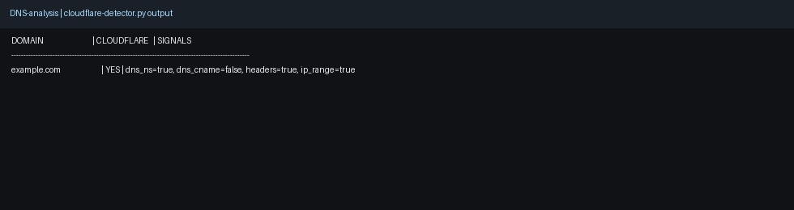
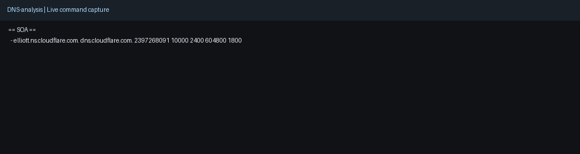

# DNS-analysis

A DNS reconnaissance and mail-security toolkit for rapid defensive triage workflows.

## Why this project

- **Impact:** Improves investigation speed for DNS, email-auth, and nameserver posture checks.
- **Scale:** Supports analyst CLI usage and automation-friendly output patterns.
- **Use case:** Domain security validation, email security assessment, and operational DNS triage.

## Demo media

- Screenshot: 
- Demo GIF: 

## Capability snapshot

- DNS posture checks across NS, MX, TXT, CAA, DMARC, and SPF
- Bulk lookup workflows for subdomains and registration checks
- Cloudflare detection with resolver and DoH fallback

## ✅ Features

- NS, MX, A/AAAA, TXT, CAA, DMARC, SPF checks
- Domain creation/age lookup
- Bulk subdomain host lookups from wordlists
- Bulk registration checks from domain lists
- Name server policy checks against expected NS values
- Cloudflare hosting detection with Python DNS (dnspython) plus DoH fallback, header, and IP evidence

---

## 📦 Requirements

- `dig`
- `host`
- `whois`
- `awk`, `sed`, `grep`
- Python 3.8+

Optional Python package:
- `dnspython` (preferred DNS resolver path for `cloudflare-detector.py`)

Optional (for QA):
- `shellcheck`

---

## 🚀 Usage

```bash
# Domain record summary
./domain-info.sh example.com

# CAA + TXT only
./domain-info.sh -a example.com

# DMARC/SPF/CAA quick email-security detail
./domain-details.sh example.com

# Wordlist host lookup (uses names file)
./domain-lookup.sh -d example.com -n names.txt

# Check expected NS values
./domain-checkNS.sh -d example.com -n "ns1.example.com,ns2.example.com"

# Domain age
./domain-age.sh example.com

# Registration checks (bulk)
./domain-registered.sh -f domains.txt

# Generate random candidate domains
./domain-random-generator.sh -n 20

# Email provider detection from MX
./domain-emailsecurityproviders.sh -f maildomains.txt

# Cloudflare detection (single domain or file)
python3 ./cloudflare-detector.py example.com
python3 ./cloudflare-detector.py -f domains.txt --json

# Equivalent explicit format switch
python3 ./cloudflare-detector.py -f domains.txt --output json
```

---

## 🧪 QA / Validation

```bash
./qa_check.sh
```

- runs `bash -n` syntax checks across `*.sh`
- runs `shellcheck` when installed

---

## ⚖️ Legal

Use only on domains/systems you own or are explicitly authorized to assess.

## Quick Demo

```bash
# 1) Run a core check
# 2) Request JSON output
# 3) Pipe into jq for analyst workflows
```

