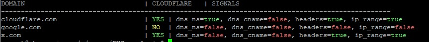

```text
██████╗ ███╗   ██╗███████╗
██╔══██╗████╗  ██║██╔════╝
██║  ██║██╔██╗ ██║███████╗
██║  ██║██║╚██╗██║╚════██║
██████╔╝██║ ╚████║███████║
╚═════╝ ╚═╝  ╚═══╝╚══════╝
```

**DNS-analysis: rapid defensive triage and infrastructure footprinting for SOC and threat hunting workflows.**

---

## Instant Setup

> [!TIP]
> Designed for fast start on Debian or Ubuntu. Copy, paste, run.

```bash
sudo apt update && sudo apt install -y dnsutils bind9-host whois python3 python3-pip jq git
git clone https://github.com/FoxSecIntel/DNS-analysis.git
cd DNS-analysis
python3 -m pip install --user dnspython
```

---

## Golden Triage Workflow

This repo is optimised for **operator workflows**, not script collecting.
Use the scenario that matches your incident or monitoring task.

### Scenario A: Threat triage
**I need to quickly profile a suspicious domain.**

```bash
./domain-info.sh --domain suspicious-example.com
```

Use this first for fast DNS context before deeper pivots.

---

### Scenario B: Brand monitoring and integrity checks
**I need to check key domains for unauthorised NS or email-security drift.**

Single domain:
```bash
python3 ./domain-security-monitor.py --domain example.com --output json
```

Batch:
```bash
python3 ./domain-security-monitor.py --input-file domains.txt --output json
```

This includes nameserver policy checks, SPF/DMARC/DKIM posture, and expiry visibility with confidence metadata.

---

### Scenario C: CDN or WAF bypass investigation
**I need origin evidence for a domain using Cloudflare.**

```bash
python3 ./cloudflare-detector.py --domain target.example
```

Use this to evaluate whether a domain is truly fronted by Cloudflare and identify signal quality.



---

## Tool Reference

| Script | Primary Use Case | Best For |
|---|---|---|
| `domain-info.sh` | Quick DNS posture summary | First-pass incident triage |
| `domain-security-monitor.py` | Structured domain security checks with confidence + data source metadata | Brand monitoring, recurring control checks |
| `domain-checkNS.sh` | Nameserver integrity validation | Drift detection and change verification |
| `cloudflare-detector.py` | Cloudflare signal analysis and origin exposure hints | CDN/WAF bypass investigations |
| `domain_security_report.py` | Aggregated reporting workflows | Scheduled reporting and analyst summaries |
| `qa_check.sh` | Local quality checks for repo scripts | Safe pre-commit validation |
| `tools/domain-posture-go/domain-posture` | Multi-threaded DNS and TLS posture reconnaissance with headers, redirect, cert expiry, security.txt, and WHOIS age | Batch triage and JSON pipeline ingestion |

---

## Advanced Automation (JSON)

> [!TIP]
> The monitor output is designed for machine filtering and SOC pipelines.

### 1) Find low-confidence findings in batch output

```bash
python3 ./domain-security-monitor.py --input-file domains.txt --output json \
| jq '.results[] | {domain, lowConfidenceSignals: (.signals | to_entries | map(select(.value.confidence == "low")))} | select(.lowConfidenceSignals | length > 0)'
```

### 2) Show failing or warning controls only

```bash
python3 ./domain-security-monitor.py --input-file domains.txt --output json \
| jq '.results[] | {domain, issues: (.signals | to_entries | map(select(.value.status == "fail" or .value.status == "warn")))} | select(.issues | length > 0)'
```

---

## Output Example (Placeholder)

> [!TIP]
> Replace this with a high-contrast terminal screenshot (Catppuccin or Tokyo Night style) showing a successful monitor run.

`docs/media/terminal-screenshot.png`

---

## Contributing

- Keep additions workflow-driven.
- Prefer confidence-scored outputs over binary pass/fail when signal quality varies.
- Include JSON examples when adding new checks.

---

## Legal and Safety

> [!WARNING]
> Use these tools only on domains and infrastructure you own or are explicitly authorised to assess. Unauthorised scanning, probing, or surveillance may violate law, policy, or contractual terms.

## License

Apache License 2.0
