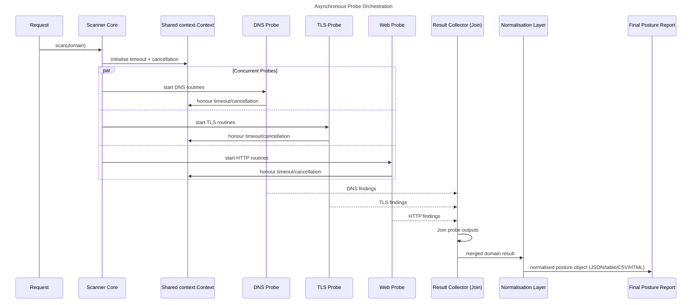

# domain-posture-go

`domain-posture` is a digital asset footprinting engine for fast, concurrent posture assessment of internet-facing domains.

It combines DNS, TLS, and HTTP probe outputs into a single normalised result per domain, suitable for analyst triage and pipeline ingestion.

---

## Why this tool exists

Security posture is fragmented across layers. DNS state, certificate configuration, and web response controls are often analysed in isolation, which slows prioritisation.

`domain-posture` orchestrates multiple probes concurrently and merges outcomes into one posture profile so teams can:

- map external exposure quickly
- prioritise weak or drifting controls
- feed machine-readable results into automation platforms

---

## Asynchronous Probe Orchestration



---

## Core probe domains

### DNS footprint

Current DNS layer resolves key routing surface:

- `A` and `AAAA` records
- domain-level reachability context

In full posture workflows, DNS record validation typically includes MX/TXT inspection and email-control parsing (SPF/DMARC). In this repository, that compliance-focused record analysis is handled by `mail-lens-go`, which is designed to chain with `domain-posture` outputs.

### TLS and cryptographic posture

The TLS layer captures:

- certificate expiry and days remaining
- redirect behaviour and HTTPS reachability
- protocol-level response quality

For cryptographic hardening programmes, this posture stream is commonly enriched with weak-cipher and deprecated-protocol checks using adjacent scanners in the same toolchain.

### HTTP security posture

The HTTP layer extracts high-signal controls:

- `Strict-Transport-Security`
- `Content-Security-Policy`
- `X-Frame-Options`
- `/.well-known/security.txt` status

---

## Technical deep-dive

### Cryptographic audit

`domain-posture` captures certificate validity horizon and reachability characteristics, which enables rapid detection of:

- expired or near-expiry certificates
- transport misconfiguration patterns

In production pipelines, these findings are often correlated with dedicated cipher/protocol scans to flag weak suites and legacy transport exposure.

### SPF/DMARC record validation logic in the posture pipeline

Email-security compliance is typically evaluated as:

1. Query TXT records.
2. Detect SPF via `v=spf1` and parse mechanisms (`include`, `ip4`, `ip6`, `a`, `mx`, `all`).
3. Detect DMARC via `_dmarc.<domain>` TXT and validate required tags (`v`, `p`) with policy posture (`none`, `quarantine`, `reject`).
4. Flag malformed syntax, missing policy, or non-enforcing configurations.

This repository’s `mail-lens-go` utility implements that focused analysis and can be composed with `domain-posture` in scheduled workflows.

### Concurrency and safety

The scanner uses worker-pool concurrency with:

- `sync.WaitGroup` for deterministic probe coordination
- channels for safe result fan-in
- bounded workers to limit descriptor pressure and avoid race-prone shared-state mutations

This design keeps behaviour predictable under load.

---

## Engineering qualities

### Observability

Results include granular per-domain error summaries so operators can distinguish failure classes, for example:

- DNS NXDOMAIN vs resolver timeout
- TLS negotiation failure vs certificate parsing issue
- HTTP connection refusal vs redirect-loop behaviour

### Modularity

Probe responsibilities are isolated, which allows incremental extension. A new probe class, for example sub-domain takeover indicators, can be added without rewriting the orchestration core.

### Scalability

The Go scheduler handles large volumes of network-bound goroutines efficiently. With tuned worker counts and timeout controls, the scanner can process large domain lists while maintaining low memory overhead.

---

## Build

```bash
cd tools/domain-posture-go
./build.sh
```

---

## Quick start

### Single domain posture

```bash
./domain-posture --domain example.com
```

### Batch posture with concurrency

```bash
./domain-posture --file domains.txt --concurrency 40 --output table
```

### JSON output for BigQuery or ELK ingestion

```bash
./domain-posture --file domains.txt --output json > posture.json
```

### CSV output for spreadsheet and BI workflows

```bash
./domain-posture --file domains.txt --output csv > posture.csv
```

### HTML report output

```bash
./domain-posture --file domains.txt --output html > posture.html
```

---

## Pipeline patterns

### BigQuery-ready pattern

```bash
./domain-posture --file domains.txt --output json > posture.json
jq -c '.[]' posture.json > posture.ndjson
```

### ELK-ready pattern

```bash
./domain-posture --file domains.txt --output json > posture.json
jq -c '.[] | {"@timestamp": now, domain: .domain, https: .https_reachable, cert_days: .cert_days_remaining, errors: .errors}' posture.json > posture-elk.ndjson
```

---

## Output summary

Default table output includes high-density operational fields.

JSON/CSV/HTML output provides structured or report-oriented formats for downstream systems.

---

## Operational notes

- Use tighter timeouts for internet-scale sweeps.
- Increase concurrency gradually to avoid local socket exhaustion.
- For complete email-domain compliance posture, run `mail-lens-go` alongside `domain-posture` and merge on domain key.
