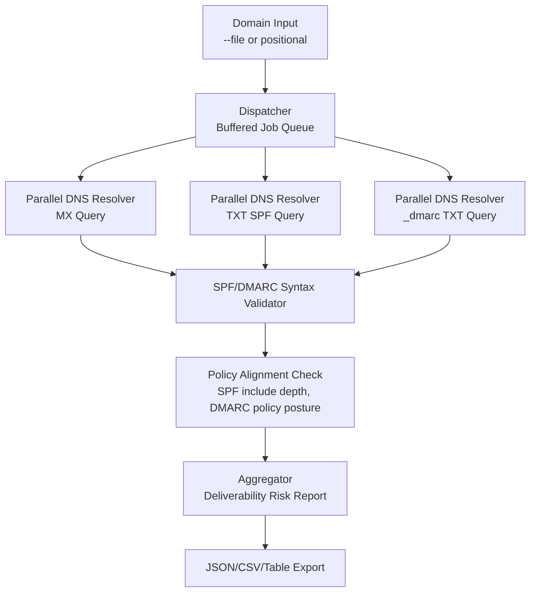

# mail-lens-go

`mail-lens` is a specialised email security and infrastructure audit engine for analysing domain-level mail trust posture at scale.

It is built for operational teams that need deterministic, automatable assessments of SPF, DMARC, and MX reliability across large domain estates.

---

## What this tool does

`mail-lens` performs recursive policy analysis, not just record retrieval.

For each target domain it evaluates:

- MX routing footprint and provider hints
- SPF policy structure and enforcement posture
- DMARC publication and policy alignment intent

The result is a consolidated deliverability and spoofing-risk profile suitable for SOC, SecOps, and platform governance workflows.

---

## Asynchronous Policy Evaluation



---

## Architecture and systems model

### Dispatcher and worker orchestration

The scanner dispatches canonicalised domains through a buffered job queue to a fixed worker pool.

- worker count is configurable
- parallel resolution is bounded to protect local resolver and socket resources
- fan-out/fan-in execution keeps throughput stable under bulk loads

### Parallel evaluators

Per-domain DNS evaluation is performed using Go resolver primitives with context-aware timeout control.

This allows independent probes for:

- MX records
- SPF-bearing TXT records
- DMARC TXT records (`_dmarc.<domain>`)

### Policy parser and evaluator

The parser inspects policy semantics, including common operational risk indicators:

- SPF terminal mechanism posture (`-all` vs `~all`)
- include-chain expansion pressure and lookup budget
- DMARC publication state and policy intent (`p=none`, `p=quarantine`, `p=reject`)

### Aggregation

Findings are normalised into deterministic result objects, then rendered in table or serialised to JSON/CSV for integration.

---

## Technical focus areas

### Recursive lookup handling (SPF include chains)

SPF policies frequently delegate authorisation via `include:` chains.

`mail-lens` is designed for recursive trust-chain evaluation and can be used to identify policy bloat patterns that approach or exceed SPF DNS lookup constraints, including the practical 10-lookup boundary.

This helps detect latent deliverability failures before they become incident tickets.

### Security logic and spoofing posture

The scanner distinguishes enforcement semantics such as:

- `-all` (hardfail): stronger anti-spoofing posture
- `~all` (softfail): weaker sender rejection semantics

Domains with permissive or weakly enforced records can be flagged as higher spoofing risk depending on operational policy.

### Timeout and bottleneck resilience

Each lookup path uses context-scoped timeout boundaries so slow or misbehaving DNS responders do not stall the full pipeline.

This improves reliability when scanning heterogeneous internet domains.

---

## Engineering characteristics

### Deterministic output

Machine-readable output is stable and predictable, enabling downstream automation in:

- SIEM/SOAR enrichment
- compliance dashboards
- continuous deliverability monitoring

### Edge case handling

The tool is designed to handle problematic domains safely, including:

- NXDOMAIN and no-answer states
- malformed or non-compliant TXT syntax
- partial policy availability (for example SPF present, DMARC missing)

Errors are captured per domain rather than crashing the batch run.

### Scalability profile

With buffered queueing and bounded workers, the scanner can process very large lists (10k+ domains) with low CPU jitter and controlled memory growth.

Operationally, tune workers and timeout according to resolver performance and host limits.

---

## Build

```bash
cd tools/mail-lens-go
./build.sh
```

---

## Usage

### Single domain

```bash
./mail-lens example.com
```

### Batch mode

```bash
./mail-lens -f domains.txt --workers 50 --timeout 2s
```

### JSON output

```bash
./mail-lens -f domains.txt --json > mail-lens.json
```

### Author metadata

```bash
./mail-lens -a
```

---

## Integration patterns

### JSON for monitoring pipelines

```bash
./mail-lens -f domains.txt --json > mail-lens.json
jq -c '.[]' mail-lens.json > mail-lens.ndjson
```

### CSV for governance reporting

```bash
./mail-lens -f domains.txt --workers 50 --timeout 2s | tee mail-lens.out
./mail-lens -f domains.txt --json | jq -r '.[] | [.domain,.provider,.primary_mx,.asn,.organisation,.error] | @csv' > mail-lens.csv
```

---

## Performance tuning guidance

- Start with moderate workers (20 to 50).
- Increase only when resolver latency and host descriptor limits are healthy.
- Keep timeout tight for broad internet scans to avoid tail-latency amplification.
- For bulk campaigns, validate file descriptor limits (`ulimit -n`) before increasing worker count.

---

## Operational interpretation

A robust posture typically includes:

- stable MX routing
- SPF records with disciplined include usage and explicit enforcement intent
- DMARC policy aligned to organisational risk appetite (`quarantine` or `reject` in mature deployments)

`mail-lens` gives a repeatable basis for prioritising remediation and tracking posture drift over time.
